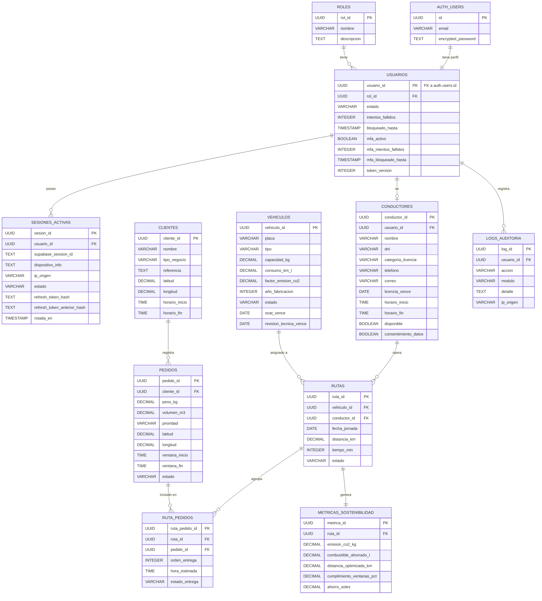

# 11. Base de Datos

## Metadatos

| Campo | Detalle |
|---|---|
| **Nombre del Proyecto** | RouteZero — Optimizador de rutas sostenibles |
| **Empresa ficticia** | Andina Reparto S.A.C. |
| **Integrantes** | Inciso Aguilar Elizabeth Antonela, Espinoza Tiza Yago Imanol, Guerra Lozano Keen, Uscuvilca Ramos Abraham Luis |
| **Fecha** | 2026-10-05 |
| **Versión** | 1.5.0 |

[← Volver al README Principal](../../README.md)

## 1. Modelo Conceptual

El sistema RouteZero gestiona las siguientes entidades principales y sus relaciones. Desde la V_1_2_0, la autenticación (contraseña, MFA) la administra **Supabase Auth** (`auth.users`, esquema interno de Supabase); `usuarios` es una tabla de perfil de aplicación que referencia a `auth.users` en vez de almacenar su propio hash de contraseña.



- **Supabase Auth** administra `auth.users` (correo, contraseña, MFA por TOTP) — esquema interno del proveedor, fuera de nuestro control directo de esquema.
- Un **Usuario** (perfil propio en `public.usuarios`) referencia 1 a 1 a un registro de `auth.users`, pertenece a un **Rol**, y puede ser un **Conductor**.
- Un **Usuario** puede tener múltiples **Sesiones activas** (una por dispositivo/login), listadas y revocables desde la aplicación.
- `vehiculos`, `clientes` y `pedidos` (módulos de flota y pedidos, implementados en el Sprint 1) ya estaban en el modelo desde la V_1_1_0; esta versión documenta cómo quedó su seguridad a nivel de fila tras implementarlos contra Supabase real (ver nota de RLS más abajo).
- `logs_auditoria` (HT-01) ya está implementada: registra login exitoso/fallido, activación/desactivación de MFA, código TOTP inválido, robo de sesión detectado y revocación de sesiones (una o todas), consultable solo por ADMINISTRADOR vía `GET /api/auditoria`.
- `conductores` (HU-009, Sprint 2) ya está implementada, con cambios respecto al diseño original (ver nota más abajo). `vehiculos` incorpora las fechas de vencimiento del SOAT y de la revisión técnica.
- El resto del modelo (rutas, métricas) sigue sin implementarse — es diseño a futuro, no cambia respecto a la V_1_2_0.

**Nota de RLS (Row Level Security).** El proyecto de Supabase tiene activado "Enable automatic RLS", que habilita RLS en **toda** tabla nueva del esquema `public`, incluidas las que no tienen dato por usuario. Sin una política, la tabla queda inaccesible en silencio (0 filas, sin error) para el rol `app_backend`. Por eso:
- `usuarios` y `sesiones_activas` (datos por usuario) tienen una política que solo deja ver la fila propia, comparando contra `app.usuario_actual_id` (la variable que fija `get_db_con_rls` en cada petición).
- `roles`, `vehiculos`, `clientes`, `conductores` y `pedidos` (datos organizacionales, no por usuario) tienen una política permisiva (`FOR ALL USING (true) WITH CHECK (true)`, o de solo lectura en `roles`): el control de acceso real sobre ellas lo aplica la API vía `requiere_rol()`, no RLS.

**Nota sobre `conductores` (Sprint 2).** Se implementó con cuatro diferencias respecto al diseño original:
- `usuario_id` es **opcional** (y sigue siendo único): el administrador registra al conductor sin crear a la vez una cuenta de acceso, porque crear usuarios en Supabase Auth requeriría la clave de servicio, que se decidió no usar. La cuenta se puede vincular después. Al borrar el usuario, el conductor se conserva (`ON DELETE SET NULL`).
- Se agregan `telefono` (contacto), `correo` (opcional), `licencia_vence` y la disponibilidad horaria (`horario_inicio`, `horario_fin`, con jornada máxima de 8 horas validada en la API, RN-002).
- **RN-013 (consentimiento explícito):** `consentimiento_datos` y `consentimiento_en` son obligatorios y la base rechaza (`CHECK`) cualquier conductor sin consentimiento.
- El DNI es dato personal (Ley N° 29733): se valida con 8 dígitos y el registro de auditoría guarda solo el identificador del conductor, nunca el DNI.

**Nota de integridad.** `sesiones_activas.usuario_id` tiene `ON DELETE CASCADE` hacia `usuarios`: sin eso, borrar un usuario de prueba con alguna sesión registrada fallaba con "Database error deleting user" desde el panel de Supabase.

**Nota de detección de robo de sesión.** Supabase no detecta el reuso de refresh tokens en este proyecto (comprobado incluso con ese ajuste propio activado en el panel), así que lo hace el backend: `sesiones_activas` guarda el hash SHA-256 del refresh token vigente (`refresh_token_hash`) y del anterior (`refresh_token_anterior_hash`, válido dentro de una ventana de gracia de 10 s tras rotar, en `rotada_en`) — nunca el token en claro. Detalle completo en la Decisión 5 de `design.md` del cambio `add-mfa-sesiones`.

## 2. Modelo Lógico

### Entidades y atributos

| Entidad | Atributos | PK | FK | Normalización |
|---|---|---|---|---|
| usuarios | usuario_id, rol_id, estado, intentos_fallidos, bloqueado_hasta, mfa_activo, mfa_intentos_fallidos, mfa_bloqueado_hasta, token_version, creado_en | usuario_id | rol_id, usuario_id → auth.users(id) | 3FN |
| sesiones_activas | sesion_id, usuario_id, supabase_session_id, dispositivo_info, ip_origen, creado_en, ultimo_uso_en, estado | sesion_id | usuario_id (ON DELETE CASCADE) | 3FN |
| roles | rol_id, nombre, descripcion | rol_id | — | 3FN |
| conductores | conductor_id, usuario_id, nombre, dni, categoria_licencia, telefono, correo, licencia_vence, horario_inicio, horario_fin, disponible, horas_conducidas_hoy, consentimiento_datos, consentimiento_en, creado_en | conductor_id | usuario_id (opcional, ON DELETE SET NULL) | 3FN |
| vehiculos | vehiculo_id, placa, tipo, capacidad_kg, consumo_km_l, factor_emision_co2, año_fabricacion, estado, creado_en, soat_vence, revision_tecnica_vence | vehiculo_id | — | 3FN |
| clientes | cliente_id, nombre, tipo_negocio, referencia, latitud, longitud, horario_inicio, horario_fin, creado_en | cliente_id | — | 3FN |
| pedidos | pedido_id, cliente_id, descripcion, peso_kg, volumen_m3, prioridad, latitud, longitud, ventana_inicio, ventana_fin, estado, creado_en | pedido_id | cliente_id | 3FN |
| rutas | ruta_id, vehiculo_id, conductor_id, fecha_jornada, distancia_km, tiempo_min, estado, creado_en | ruta_id | vehiculo_id, conductor_id | 3FN |
| ruta_pedidos | ruta_pedido_id, ruta_id, pedido_id, orden_entrega, hora_estimada, estado_entrega | ruta_pedido_id | ruta_id, pedido_id | 3FN |
| metricas_sostenibilidad | metrica_id, ruta_id, emision_co2_kg, combustible_ahorrado_l, distancia_optimizada_km, cumplimiento_ventanas_pct, ahorro_soles, creado_en | metrica_id | ruta_id | 3FN |
| logs_auditoria | log_id, usuario_id, accion, modulo, detalle, ip_origen, creado_en | log_id | usuario_id | 3FN |

## 3. Modelo Físico (DDL SQL)

```sql
-- Extensión para UUIDs
CREATE EXTENSION IF NOT EXISTS "pgcrypto";

-- Tabla: roles
CREATE TABLE roles (
    rol_id UUID PRIMARY KEY DEFAULT gen_random_uuid(),
    nombre VARCHAR(50) NOT NULL UNIQUE,
    descripcion TEXT,
    creado_en TIMESTAMP WITH TIME ZONE DEFAULT CURRENT_TIMESTAMP
);

CREATE INDEX idx_roles_nombre ON roles(nombre);

-- roles es de referencia (sin dato por usuario), pero "Enable automatic RLS" del proyecto
-- la alcanza igual: sin política quedaba inaccesible en silencio para app_backend.
ALTER TABLE roles ENABLE ROW LEVEL SECURITY;
CREATE POLICY roles_lectura_app ON roles FOR SELECT USING (true);

-- Tabla: usuarios (perfil de aplicación; la autenticación real vive en auth.users de Supabase)
CREATE TABLE usuarios (
    usuario_id UUID PRIMARY KEY REFERENCES auth.users(id) ON DELETE CASCADE,
    rol_id UUID NOT NULL,
    estado VARCHAR(20) NOT NULL DEFAULT 'ACTIVO'
        CHECK (estado IN ('ACTIVO', 'BLOQUEADO', 'INACTIVO')),
    intentos_fallidos INTEGER DEFAULT 0,
    bloqueado_hasta TIMESTAMP WITH TIME ZONE,
    mfa_activo BOOLEAN NOT NULL DEFAULT FALSE,
    mfa_intentos_fallidos INTEGER NOT NULL DEFAULT 0,
    mfa_bloqueado_hasta TIMESTAMP WITH TIME ZONE,
    token_version INTEGER NOT NULL DEFAULT 1,
    creado_en TIMESTAMP WITH TIME ZONE DEFAULT CURRENT_TIMESTAMP,
    CONSTRAINT fk_usuarios_rol FOREIGN KEY (rol_id) REFERENCES roles(rol_id)
);

CREATE INDEX idx_usuarios_rol ON usuarios(rol_id);

ALTER TABLE usuarios ENABLE ROW LEVEL SECURITY;
-- NULLIF(..., '') evita que la política reviente si la variable de sesión no llegó a fijarse
-- (por ejemplo, una consulta hecha fuera de get_db_con_rls): sin usuario_actual_id, no hay filas.
CREATE POLICY usuarios_solo_propio ON usuarios
    USING (usuario_id = NULLIF(current_setting('app.usuario_actual_id', true), '')::UUID);

-- Tabla: sesiones_activas (espejo propio del estado de las sesiones de Supabase Auth)
CREATE TABLE sesiones_activas (
    sesion_id UUID PRIMARY KEY DEFAULT gen_random_uuid(),
    usuario_id UUID NOT NULL REFERENCES usuarios(usuario_id) ON DELETE CASCADE,
    supabase_session_id TEXT NOT NULL UNIQUE,
    dispositivo_info TEXT,
    ip_origen VARCHAR(45),
    creado_en TIMESTAMP WITH TIME ZONE DEFAULT CURRENT_TIMESTAMP,
    ultimo_uso_en TIMESTAMP WITH TIME ZONE DEFAULT CURRENT_TIMESTAMP,
    estado VARCHAR(20) NOT NULL DEFAULT 'ACTIVA'
        CHECK (estado IN ('ACTIVA', 'REVOCADA', 'EXPIRADA')),
    -- Detección propia de reuso de refresh tokens (Supabase no la hace en este proyecto,
    -- ver design.md de add-mfa-sesiones, Decisión 5): solo se guardan hashes, nunca el token.
    refresh_token_hash TEXT,
    refresh_token_anterior_hash TEXT,
    rotada_en TIMESTAMP WITH TIME ZONE
);

CREATE INDEX idx_sesiones_usuario ON sesiones_activas(usuario_id);
CREATE INDEX idx_sesiones_estado ON sesiones_activas(estado);

ALTER TABLE sesiones_activas ENABLE ROW LEVEL SECURITY;
CREATE POLICY sesiones_solo_propias ON sesiones_activas
    USING (usuario_id = NULLIF(current_setting('app.usuario_actual_id', true), '')::UUID);

-- Tabla: conductores
CREATE TABLE conductores (
    conductor_id UUID PRIMARY KEY DEFAULT gen_random_uuid(),
    usuario_id UUID UNIQUE REFERENCES usuarios(usuario_id) ON DELETE SET NULL,
    nombre VARCHAR(100) NOT NULL,
    dni VARCHAR(8) NOT NULL UNIQUE CHECK (dni ~ '^[0-9]{8}$'),
    categoria_licencia VARCHAR(10) NOT NULL,
    telefono VARCHAR(15) NOT NULL,
    correo VARCHAR(254),
    licencia_vence DATE NOT NULL,
    horario_inicio TIME NOT NULL DEFAULT '06:00',
    horario_fin TIME NOT NULL DEFAULT '14:00',
    disponible BOOLEAN NOT NULL DEFAULT TRUE,
    horas_conducidas_hoy DECIMAL(4,2) NOT NULL DEFAULT 0,
    consentimiento_datos BOOLEAN NOT NULL,
    consentimiento_en TIMESTAMP WITH TIME ZONE NOT NULL,
    creado_en TIMESTAMP WITH TIME ZONE NOT NULL DEFAULT CURRENT_TIMESTAMP,
    CONSTRAINT ck_conductores_consentimiento CHECK (consentimiento_datos = TRUE)
);

CREATE INDEX idx_conductores_disponible ON conductores(disponible);

-- conductores es organizacional (el control de acceso real lo aplica la API con
-- requiere_rol("ADMINISTRADOR")); la política evita que "Enable automatic RLS" la deje inaccesible.
ALTER TABLE conductores ENABLE ROW LEVEL SECURITY;
CREATE POLICY conductores_acceso_app ON conductores FOR ALL USING (true) WITH CHECK (true);
GRANT ALL ON conductores TO app_backend, app_admin;

-- Tabla: vehiculos
CREATE TABLE vehiculos (
    vehiculo_id UUID PRIMARY KEY DEFAULT gen_random_uuid(),
    placa VARCHAR(10) NOT NULL UNIQUE,
    tipo VARCHAR(30) NOT NULL
        CHECK (tipo IN ('CAMIONETA', 'FURGON', 'MOTO')),
    capacidad_kg DECIMAL(8,2) NOT NULL,
    consumo_km_l DECIMAL(6,2) NOT NULL,
    factor_emision_co2 DECIMAL(6,4) NOT NULL,
    "año_fabricacion" INTEGER NOT NULL,
    estado VARCHAR(20) NOT NULL DEFAULT 'DISPONIBLE'
        CHECK (estado IN ('DISPONIBLE', 'EN_RUTA', 'MANTENIMIENTO', 'INACTIVO')),
    creado_en TIMESTAMP WITH TIME ZONE DEFAULT CURRENT_TIMESTAMP,
    soat_vence DATE,                -- vencimiento del SOAT (opcional)
    revision_tecnica_vence DATE     -- vencimiento de la revisión técnica (opcional)
);

CREATE INDEX idx_vehiculos_placa ON vehiculos(placa);
CREATE INDEX idx_vehiculos_estado ON vehiculos(estado);

-- vehiculos es organizacional (toda la flota, no por usuario): el control de acceso real lo
-- aplica la API con requiere_rol("ADMINISTRADOR"), no RLS — la política solo evita que
-- "Enable automatic RLS" deje la tabla inaccesible en silencio.
ALTER TABLE vehiculos ENABLE ROW LEVEL SECURITY;
CREATE POLICY vehiculos_acceso_app ON vehiculos FOR ALL USING (true) WITH CHECK (true);

-- Tabla: clientes
CREATE TABLE clientes (
    cliente_id UUID PRIMARY KEY DEFAULT gen_random_uuid(),
    nombre VARCHAR(150) NOT NULL,
    tipo_negocio VARCHAR(50) NOT NULL
        CHECK (tipo_negocio IN ('BODEGA', 'RESTAURANTE', 'MERCADO', 'COMERCIO', 'OTRO')),
    referencia TEXT,
    latitud DECIMAL(10,8) NOT NULL,
    longitud DECIMAL(11,8) NOT NULL,
    horario_inicio TIME NOT NULL DEFAULT '06:00:00',
    horario_fin TIME NOT NULL DEFAULT '21:00:00',
    creado_en TIMESTAMP WITH TIME ZONE DEFAULT CURRENT_TIMESTAMP
);

CREATE INDEX idx_clientes_tipo ON clientes(tipo_negocio);
CREATE INDEX idx_clientes_coords ON clientes(latitud, longitud);

-- clientes es organizacional, igual razón que vehiculos: acceso real vía
-- requiere_rol("OPERADOR", "ADMINISTRADOR") en la API.
ALTER TABLE clientes ENABLE ROW LEVEL SECURITY;
CREATE POLICY clientes_acceso_app ON clientes FOR ALL USING (true) WITH CHECK (true);

-- Tabla: pedidos
CREATE TABLE pedidos (
    pedido_id UUID PRIMARY KEY DEFAULT gen_random_uuid(),
    cliente_id UUID NOT NULL,
    descripcion TEXT,
    peso_kg DECIMAL(8,2) NOT NULL,
    volumen_m3 DECIMAL(6,3),
    prioridad VARCHAR(20) NOT NULL DEFAULT 'ESTANDAR'
        CHECK (prioridad IN ('EXPRESS', 'ESTANDAR', 'ECONOMICO')),
    latitud DECIMAL(10,8) NOT NULL,
    longitud DECIMAL(11,8) NOT NULL,
    ventana_inicio TIME NOT NULL,
    ventana_fin TIME NOT NULL,
    estado VARCHAR(20) NOT NULL DEFAULT 'PENDIENTE'
        CHECK (estado IN ('PENDIENTE', 'ASIGNADO', 'EN_CAMINO', 'ENTREGADO', 'CANCELADO')),
    creado_en TIMESTAMP WITH TIME ZONE DEFAULT CURRENT_TIMESTAMP,
    CONSTRAINT fk_pedidos_cliente FOREIGN KEY (cliente_id) REFERENCES clientes(cliente_id)
);

CREATE INDEX idx_pedidos_cliente ON pedidos(cliente_id);
CREATE INDEX idx_pedidos_estado ON pedidos(estado);
CREATE INDEX idx_pedidos_prioridad ON pedidos(prioridad);
CREATE INDEX idx_pedidos_coords ON pedidos(latitud, longitud);

-- pedidos es organizacional, igual razón que vehiculos/clientes.
ALTER TABLE pedidos ENABLE ROW LEVEL SECURITY;
CREATE POLICY pedidos_acceso_app ON pedidos FOR ALL USING (true) WITH CHECK (true);

-- Tabla: rutas
CREATE TABLE rutas (
    ruta_id UUID PRIMARY KEY DEFAULT gen_random_uuid(),
    vehiculo_id UUID NOT NULL,
    conductor_id UUID NOT NULL,
    fecha_jornada DATE NOT NULL,
    distancia_km DECIMAL(8,2),
    tiempo_min INTEGER,
    estado VARCHAR(20) NOT NULL DEFAULT 'PLANIFICADA'
        CHECK (estado IN ('PLANIFICADA', 'EN_EJECUCION', 'COMPLETADA', 'CANCELADA')),
    creado_en TIMESTAMP WITH TIME ZONE DEFAULT CURRENT_TIMESTAMP,
    CONSTRAINT fk_rutas_vehiculo FOREIGN KEY (vehiculo_id) REFERENCES vehiculos(vehiculo_id),
    CONSTRAINT fk_rutas_conductor FOREIGN KEY (conductor_id) REFERENCES conductores(conductor_id)
);

CREATE INDEX idx_rutas_fecha ON rutas(fecha_jornada);
CREATE INDEX idx_rutas_estado ON rutas(estado);
CREATE INDEX idx_rutas_vehiculo ON rutas(vehiculo_id);
CREATE INDEX idx_rutas_conductor ON rutas(conductor_id);

-- Tabla: ruta_pedidos
CREATE TABLE ruta_pedidos (
    ruta_pedido_id UUID PRIMARY KEY DEFAULT gen_random_uuid(),
    ruta_id UUID NOT NULL,
    pedido_id UUID NOT NULL,
    orden_entrega INTEGER NOT NULL,
    hora_estimada TIME,
    estado_entrega VARCHAR(20) NOT NULL DEFAULT 'PENDIENTE'
        CHECK (estado_entrega IN ('PENDIENTE', 'ENTREGADO', 'FALLIDO')),
    CONSTRAINT fk_rp_ruta FOREIGN KEY (ruta_id) REFERENCES rutas(ruta_id),
    CONSTRAINT fk_rp_pedido FOREIGN KEY (pedido_id) REFERENCES pedidos(pedido_id),
    CONSTRAINT uq_ruta_pedido UNIQUE (ruta_id, pedido_id)
);

CREATE INDEX idx_ruta_pedidos_ruta ON ruta_pedidos(ruta_id);
CREATE INDEX idx_ruta_pedidos_pedido ON ruta_pedidos(pedido_id);

-- Tabla: metricas_sostenibilidad
CREATE TABLE metricas_sostenibilidad (
    metrica_id UUID PRIMARY KEY DEFAULT gen_random_uuid(),
    ruta_id UUID NOT NULL UNIQUE,
    emision_co2_kg DECIMAL(10,4) NOT NULL DEFAULT 0,
    combustible_ahorrado_l DECIMAL(10,4) NOT NULL DEFAULT 0,
    distancia_optimizada_km DECIMAL(10,2) NOT NULL DEFAULT 0,
    cumplimiento_ventanas_pct DECIMAL(5,2) NOT NULL DEFAULT 0,
    ahorro_soles DECIMAL(10,2) NOT NULL DEFAULT 0,
    creado_en TIMESTAMP WITH TIME ZONE DEFAULT CURRENT_TIMESTAMP,
    CONSTRAINT fk_metricas_ruta FOREIGN KEY (ruta_id) REFERENCES rutas(ruta_id)
);

CREATE INDEX idx_metricas_ruta ON metricas_sostenibilidad(ruta_id);

-- Tabla: logs_auditoria
CREATE TABLE logs_auditoria (
    log_id UUID PRIMARY KEY DEFAULT gen_random_uuid(),
    usuario_id UUID,
    accion VARCHAR(100) NOT NULL,
    modulo VARCHAR(50) NOT NULL,
    detalle TEXT,
    ip_origen VARCHAR(45),
    creado_en TIMESTAMP WITH TIME ZONE DEFAULT CURRENT_TIMESTAMP,
    CONSTRAINT fk_logs_usuario FOREIGN KEY (usuario_id) REFERENCES usuarios(usuario_id)
);

CREATE INDEX idx_logs_usuario ON logs_auditoria(usuario_id);
CREATE INDEX idx_logs_modulo ON logs_auditoria(modulo);
CREATE INDEX idx_logs_creado ON logs_auditoria(creado_en);

-- logs_auditoria es organizacional (registra eventos de todos los usuarios, no por cuenta):
-- el control de acceso real lo aplica la API con requiere_rol("ADMINISTRADOR") sobre el
-- único endpoint de lectura (GET /api/auditoria); la política solo evita que "Enable
-- automatic RLS" la deje inaccesible en silencio. A propósito NO se otorga DELETE ni UPDATE
-- a los roles de aplicación: el registro de auditoría es de solo inserción y lectura, para
-- que ni siquiera un error en la API pueda alterar o borrar el rastro.
ALTER TABLE logs_auditoria ENABLE ROW LEVEL SECURITY;
CREATE POLICY logs_auditoria_acceso_app ON logs_auditoria FOR ALL USING (true) WITH CHECK (true);
GRANT SELECT, INSERT ON logs_auditoria TO app_backend, app_admin;

-- Datos iniciales: roles del sistema
INSERT INTO roles (nombre, descripcion) VALUES
    ('ADMINISTRADOR', 'Acceso completo a todos los módulos del sistema'),
    ('OPERADOR', 'Gestión de pedidos y clientes'),
    ('CONDUCTOR', 'Acceso en modo conductor a rutas asignadas'),
    ('GERENTE', 'Acceso de lectura a dashboard y reportes'),
    ('AUDITOR', 'Acceso de lectura a reportes y logs de auditoría');

-- Función auxiliar: ubicar el usuario_id (mismo id que auth.users) a partir de un correo.
-- SECURITY DEFINER porque auth.users no es legible directamente por app_backend/app_admin.
CREATE OR REPLACE FUNCTION public.usuario_id_por_email(p_email TEXT)
RETURNS UUID
LANGUAGE sql
SECURITY DEFINER
SET search_path = public, auth
AS $$
    SELECT id FROM auth.users WHERE lower(email) = lower(p_email) LIMIT 1
$$;
```

### Roles de base de datos

Dos roles de PostgreSQL, creados una sola vez desde el SQL Editor de Supabase (no forman parte del DDL de las tablas, que se repite en cada entorno; los roles son infraestructura del proyecto):

```sql
CREATE ROLE app_backend LOGIN PASSWORD '••••••••';   -- respeta RLS: lo usa la API web
CREATE ROLE app_admin LOGIN PASSWORD '•••••••• ' BYPASSRLS;  -- salta RLS: solo los jobs de mantenimiento

GRANT USAGE ON SCHEMA public TO app_backend, app_admin;
GRANT ALL ON ALL TABLES IN SCHEMA public TO app_backend, app_admin;
ALTER DEFAULT PRIVILEGES IN SCHEMA public GRANT ALL ON TABLES TO app_backend, app_admin;
```

- `DATABASE_URL` (`.env`) se conecta con `app_backend`: sujeto a RLS, es el que usa la API en cada petición.
- `DATABASE_ADMIN_URL` se conecta con `app_admin` (`BYPASSRLS`): solo lo usa `python -m src.auth.mantenimiento`, nunca la API web.
- Ninguna de las dos conexiones usa el rol `postgres`, que se saltaría RLS igual que `app_admin` pero sin la intención explícita de hacerlo.

[← Volver al README Principal](../../README.md)

## Historial de Control de Cambios

| Versión | Fecha | Cambio realizado | Responsable |
|---|---|---|---|
| V_1_0_0 | 2026-09-05 | Versión inicial | Inciso Aguilar Elizabeth Antonela |
| V_1_1_0 | 2026-09-14 | Adición de diagrama ER Mermaid en Modelo Conceptual | Inciso Aguilar Elizabeth Antonela |
| V_1_2_0 | 2026-09-25 | `usuarios` deja de almacenar `password_hash` y su PK pasa a referenciar `auth.users(id)` de Supabase Auth; se agregan columnas de MFA (`mfa_activo`, `mfa_intentos_fallidos`, `mfa_bloqueado_hasta`) y `token_version`; se agrega la tabla `sesiones_activas`; ambas con RLS habilitado. Resultado del cambio OpenSpec `add-mfa-sesiones` | Inciso Aguilar Elizabeth Antonela |
| V_1_3_0 | 2026-09-28 | Documenta cómo quedó la base tras implementar autenticación, flota y pedidos contra Supabase real: columnas `refresh_token_hash`, `refresh_token_anterior_hash` y `rotada_en` en `sesiones_activas` (detección propia de reuso de refresh tokens); `ON DELETE CASCADE` en `sesiones_activas.usuario_id → usuarios`; política RLS permisiva en `roles`, `vehiculos`, `clientes` y `pedidos` (tablas organizacionales sin dato por usuario, alcanzadas igual por "Enable automatic RLS" de Supabase); predicado de las políticas de `usuarios`/`sesiones_activas` reforzado con `NULLIF(..., '')`; se documentan los roles de base de datos `app_backend`/`app_admin` y la función `usuario_id_por_email` | Inciso Aguilar Elizabeth Antonela |
| V_1_4_0 | 2026-09-28 | Se implementa `logs_auditoria` (HT-01): RLS con política permisiva igual que las demás tablas organizacionales, y `GRANT` explícito de solo `SELECT`/`INSERT` a `app_backend`/`app_admin` — a propósito sin `DELETE` ni `UPDATE`, para que el registro de auditoría no pueda alterarse desde la API | Inciso Aguilar Elizabeth Antonela |
| V_1_5_0 | 2026-10-05 | Se implementa `conductores` (HU-009): `usuario_id` pasa a ser opcional (`ON DELETE SET NULL`), se agregan `telefono`, `correo`, `licencia_vence`, la disponibilidad horaria (`horario_inicio`, `horario_fin`) y el consentimiento explícito de RN-013 (`consentimiento_datos`, `consentimiento_en`, con `CHECK`); se elimina el índice sobre `dni` por ser redundante con su restricción `UNIQUE`; política RLS permisiva igual que las demás tablas organizacionales. `vehiculos` incorpora `soat_vence` y `revision_tecnica_vence` (opcionales) | Inciso Aguilar Elizabeth Antonela |
