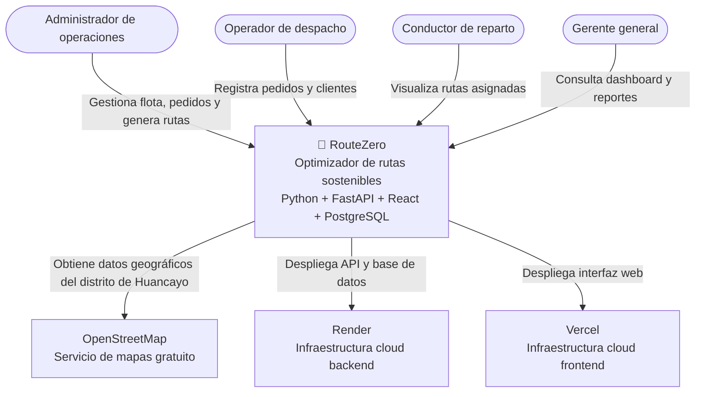
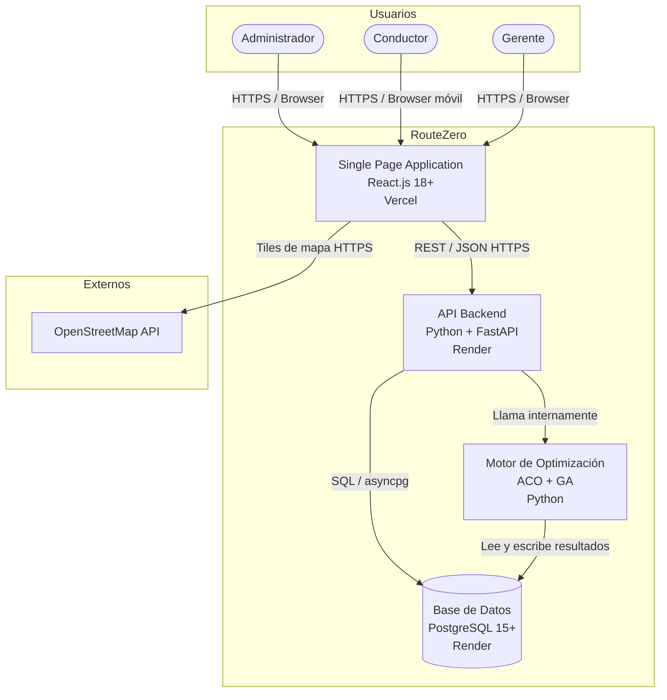
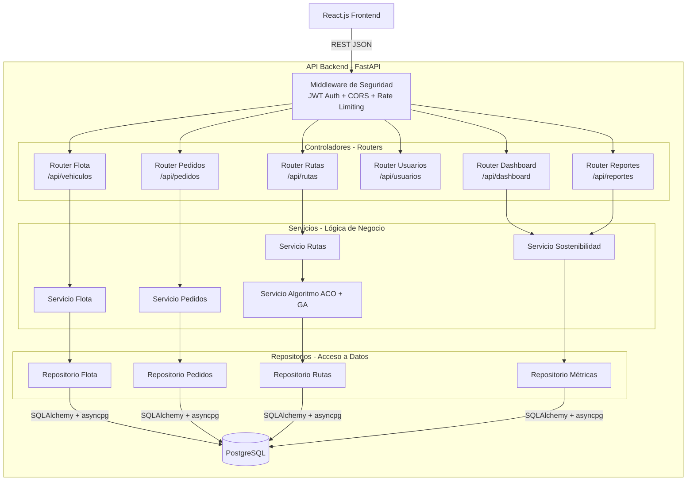
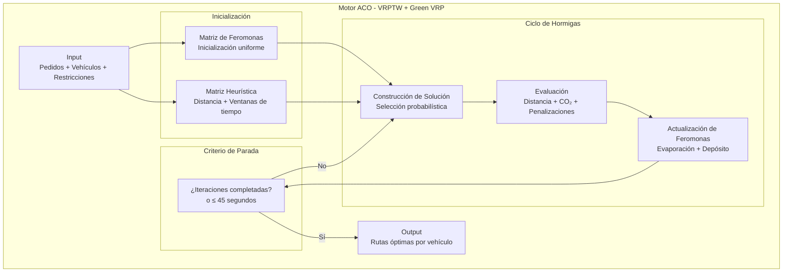

# 12. Modelo C4 — Arquitectura de Software

## Metadatos

| Campo | Detalle |
|---|---|
| **Nombre del Proyecto** | RouteZero — Optimizador de rutas sostenibles |
| **Empresa ficticia** | Andina Reparto S.A.C. |
| **Integrantes** | Inciso Aguilar Elizabeth Antonela, Espinoza Tiza Yago Imanol, Guerra Lozano Keen, Uscuvilca Ramos Abraham Luis |
| **Fecha** | 2026-09-05 |
| **Versión** | 1.0.0 |

## 1. Nivel 1 — Diagrama de Contexto

Muestra el sistema RouteZero en relación con los usuarios externos y sistemas externos con los que interactúa.

## 2. Nivel 2 — Diagrama de Contenedores

Muestra los contenedores principales del sistema RouteZero y cómo se comunican entre sí.

## 3. Nivel 3 — Diagrama de Componentes

Muestra la estructura interna del contenedor API Backend (FastAPI), detallando sus módulos principales.

## 4. Nivel 4 — Diagrama de Código (Motor de Optimización ACO)

Muestra la estructura interna del componente crítico del sistema: el motor de optimización ACO.

