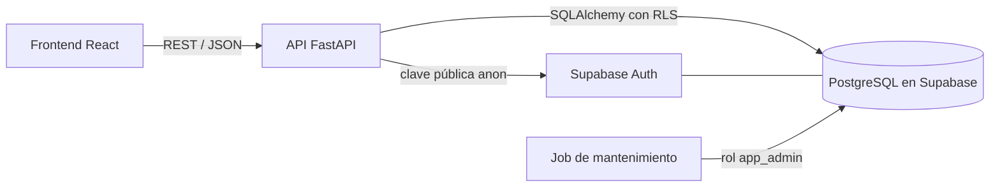
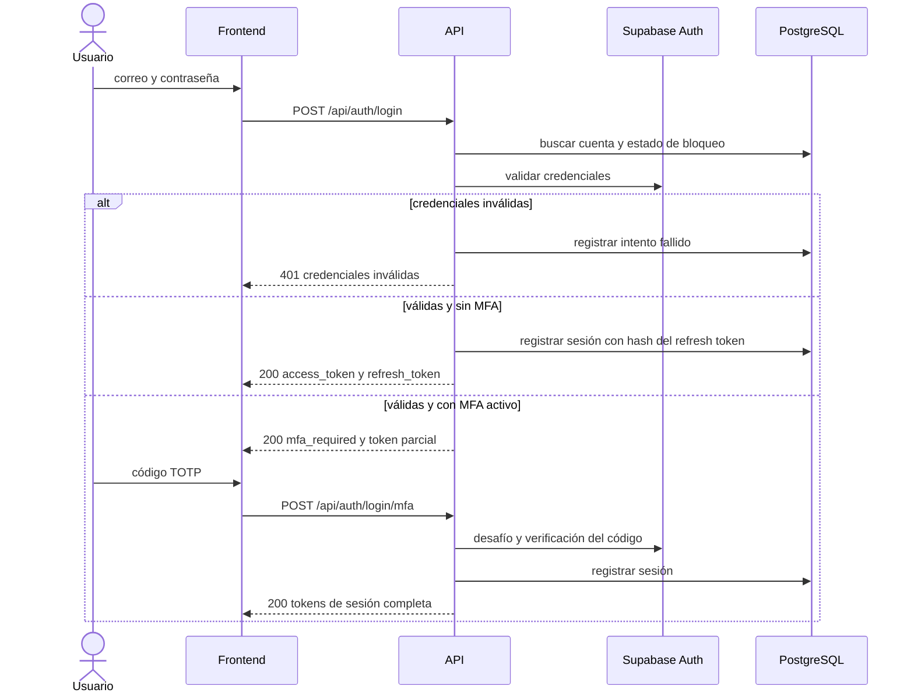
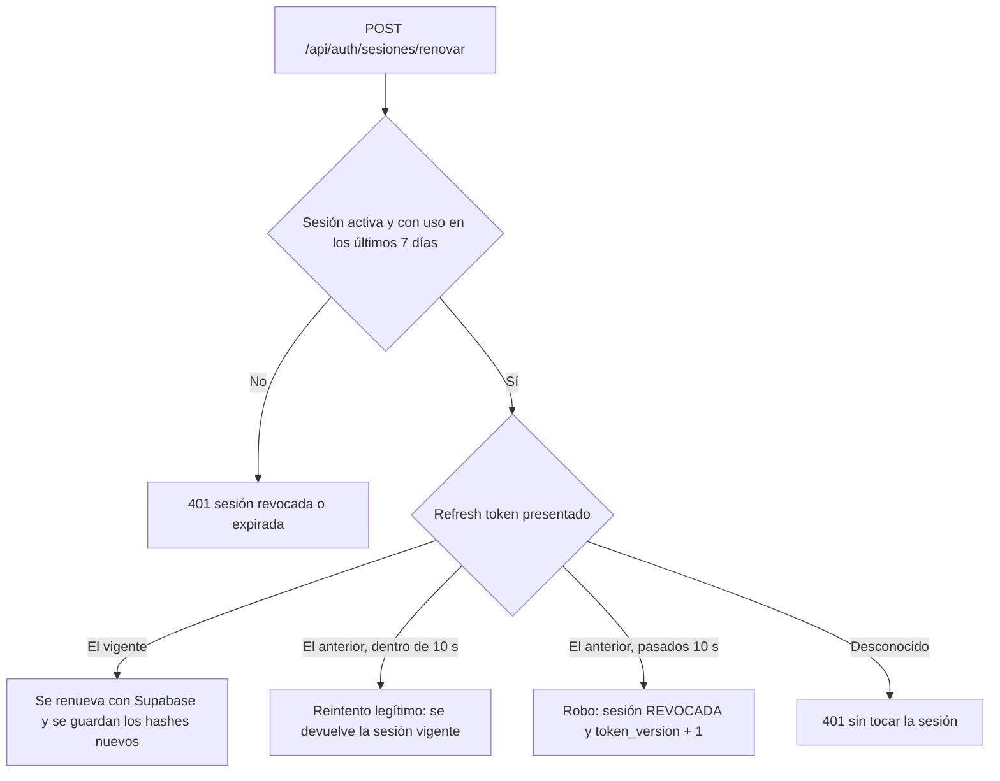

# 02 Implementación del Módulo de Autenticación

## Metadatos

| Campo | Detalle |
|---|---|
| **Nombre del Proyecto** | RouteZero — Optimizador de rutas sostenibles |
| **Empresa ficticia** | Andina Reparto S.A.C. |
| **Integrantes** | Inciso Aguilar Elizabeth Antonela, Espinoza Tiza Yago Imanol, Guerra Lozano Keen, Uscuvilca Ramos Abraham Luis |
| **Fecha** | 2026-09-26 |
| **Épica** | EP-01 Seguridad y Acceso |
| **Cambio OpenSpec** | `add-mfa-sesiones` |
| **Versión** | 1.0.0 |

[← Volver al README Principal](../../../README.md)

---

## 1. Alcance y trazabilidad

El módulo implementa el inicio de sesión con segundo factor (MFA por TOTP) y la gestión segura de sesiones del backend de RouteZero. Extiende lo definido en RF-011 y en las historias HU-001, HU-002 y HT-01.

| Requisito | Cómo se cubre |
|---|---|
| RF-011 Autenticación y control de acceso | Inicio de sesión, MFA, sesiones; control por rol pendiente (ver documento 01) |
| HU-001 Iniciar sesión | `POST /api/auth/login` y `POST /api/auth/login/mfa` |
| RN-001 Bloqueo tras 3 intentos fallidos | Contador propio por cuenta, 15 minutos, con tiempo restante en la respuesta |
| RN-014 Mínimo privilegio | Seguridad a nivel de fila (RLS): cada usuario solo lee sus propios registros |
| HT-01 JWT y OWASP Top 10 | Ver sección 6 |
| RNF-013 / Ley N° 29733 | No se guardan contraseñas ni secretos TOTP propios; hashes de tokens en lugar de tokens |

Especificación completa, criterios de aceptación y tareas: [`openspec/changes/add-mfa-sesiones/`](../../../openspec/changes/add-mfa-sesiones/).

## 2. Arquitectura

El frontend **nunca** habla con Supabase: todo pasa por la API propia, que actúa como intermediario. Supabase aporta la identidad (contraseña, emisión de JWT, MFA por TOTP) y la base de datos PostgreSQL; las reglas de negocio de RouteZero que Supabase no ofrece con la precisión requerida las aplica el backend.



Organización del código por características (HT-08), con patrón Repository:

```text
backend/src/
├── main.py                  # aplicación FastAPI y CORS
├── core/
│   ├── config.py            # variables de entorno
│   ├── database.py          # conexión y sesión con RLS
│   └── security.py          # verificación del JWT y autorización
└── auth/
    ├── router.py            # endpoints de MFA
    ├── router_sesiones.py   # login, renovar, listar y revocar sesiones
    ├── service_mfa.py       # lógica de MFA
    ├── service_sesiones.py  # lógica de sesiones
    ├── repository.py        # acceso a datos (SQL parametrizado)
    ├── schemas.py           # validación de entrada (Pydantic)
    ├── supabase_client.py   # llamadas a Supabase Auth
    ├── politicas.py         # parámetros de negocio
    └── mantenimiento.py     # job de limpieza de sesiones
```

## 3. Endpoints

| Método | Ruta | Requiere | Descripción |
|---|---|---|---|
| POST | `/api/auth/login` | Credenciales | Inicia sesión. Devuelve tokens, o `mfa_required` si la cuenta tiene MFA |
| POST | `/api/auth/login/mfa` | Token parcial del paso 1 | Completa el inicio de sesión con el código TOTP |
| POST | `/api/auth/sesiones/renovar` | Par de tokens | Renueva los tokens; detecta el reuso de un token ya rotado |
| GET | `/api/auth/sesiones` | Sesión activa | Lista las sesiones propias (dispositivo, IP, fechas, cuál es la actual) |
| DELETE | `/api/auth/sesiones/{sesion_id}` | Sesión activa | Revoca una sesión propia |
| DELETE | `/api/auth/sesiones` | Sesión activa | Cierra todas las sesiones propias |
| POST | `/api/auth/mfa/inscribir` | Sesión activa | Inicia la inscripción de MFA y entrega el QR |
| POST | `/api/auth/mfa/confirmar` | Sesión activa | Confirma la inscripción con un código TOTP |
| POST | `/api/auth/mfa/desactivar` | Sesión activa | Desactiva el MFA (contraseña y código vigentes) |

Documentación interactiva: `/docs` (Swagger/OpenAPI generado por FastAPI).

## 4. Flujos principales

### 4.1 Inicio de sesión con segundo factor



Supabase entrega siempre una sesión de nivel bajo (aal1) tras la contraseña. Para una cuenta con MFA, esa sesión parcial **no sirve para usar la API**: el backend exige nivel aal2 y una sesión registrada y activa en toda petición autorizada.

### 4.2 Renovación de tokens y detección de robo



## 5. Modelo de datos

Definido en [`11. Base de datos`](../../01%20Inicio/11.%20Base%20de%20datos%20V_1_2_0.md). Resumen de lo que agrega este módulo:

| Tabla / objeto | Propósito |
|---|---|
| `usuarios` | Perfil de aplicación enlazado a `auth.users`. Contadores de bloqueo independientes (contraseña y MFA), `mfa_activo` y `token_version` |
| `sesiones_activas` | Sesiones visibles para el usuario. Guarda solo el **hash** SHA-256 del refresh token vigente y del anterior; es la fuente de verdad de la API sobre qué sesiones están activas |
| Políticas RLS | `usuarios_solo_propio` y `sesiones_solo_propias`: cada consulta ve solo las filas del usuario autenticado; sin usuario fijado no se ve ninguna fila |
| Rol `app_backend` | Rol con el que se conecta la API, **sin** `BYPASSRLS` |
| Rol `app_admin` | Solo para el job de mantenimiento, con `BYPASSRLS` |
| Función `usuario_id_por_email` | `SECURITY DEFINER`; permite al login localizar la cuenta sin dar acceso al esquema `auth` |
| Hook de token de acceso | Agrega el reclamo `ver` con `token_version` a cada token emitido |

## 6. Seguridad: mapeo a OWASP Top 10

| Riesgo OWASP | Medida aplicada |
|---|---|
| A01 Control de acceso roto | Sesión registrada y activa en cada petición; RLS en base de datos; ningún endpoint acepta un `usuario_id` como parámetro (siempre sale del token) |
| A02 Fallas criptográficas | Firma del JWT verificada con llaves asimétricas (ES256, JWKS público); no se guardan contraseñas propias; de los refresh tokens solo se guarda su hash |
| A03 Inyección | SQL siempre parametrizado con SQLAlchemy; validación estricta de entradas con Pydantic (patrones, longitudes) |
| A04 Diseño inseguro | Revocación inmediata de tokens con `token_version`; ventana de gracia de 10 s para reintentos legítimos; caducidad de sesión a los 7 días |
| A05 Configuración de seguridad incorrecta | CORS restringido al origen exacto del frontend; API de datos de Supabase desactivada; secretos solo en variables de entorno; sin clave administrativa `service_role` |
| A07 Fallas de identificación y autenticación | MFA con TOTP; bloqueo de 3 intentos por 15 minutos, también para el código TOTP (contador independiente); mensaje genérico ante credenciales inválidas |
| A09 Fallas de registro y monitoreo | **Pendiente**: registro de eventos en `logs_auditoria` |

### Limitaciones conocidas

- El bloqueo por intentos solo cubre los inicios de sesión que pasan por la API propia. Como la clave pública de Supabase es pública por diseño, un atacante puede probar contraseñas directamente contra Supabase (con su limitación de tasa por IP). Un token obtenido así **no sirve** contra nuestra API, pero se mitiga además con MFA para roles privilegiados.
- La invalidación de una sesión concreta se refleja de inmediato en nuestra API, pero Supabase no ofrece invalidar una sesión ajena puntual; por eso la tabla `sesiones_activas` es la fuente de verdad.
- Un access token vencido más un refresh token propio ya usado podrían forzar el cierre de sesión de otra cuenta (impacto: cierre forzado, sin acceso a datos). Se acepta para el MVP.

## 7. Decisiones de diseño y gestión del cambio

Las decisiones se tomaron probando contra el proveedor real y, cuando la evidencia contradijo el diseño inicial, se cambió y se documentó:

| Decisión | Alternativa descartada | Motivo |
|---|---|---|
| Delegar identidad en Supabase Auth (contraseña, JWT, TOTP) | Construirlo con `pyotp` y `bcrypt` propios | Menos código de seguridad propio; el equipo ya conocía la plataforma. Se conservaron las reglas de negocio que Supabase no cubre (RN-001, contador MFA) |
| La API es el único intermediario con Supabase | Que el frontend use `supabase-js` directamente | Mantiene la arquitectura de tres capas de la fase de Inicio y centraliza las reglas de bloqueo |
| Base de datos en Supabase en lugar de Render | PostgreSQL en Render | Base compartida en la nube, administración visual de RLS |
| Detección de reuso de refresh tokens **propia** | Confiar en la detección de Supabase | Se comprobó que Supabase aceptó tokens ya rotados incluso con su ajuste activado |
| Sin clave `service_role`; la tabla `sesiones_activas` es autoritativa | Revocar sesiones ajenas con la clave administrativa | El endpoint administrativo no existe (responde 404); además se elimina un secreto de alto privilegio |
| Verificación del JWT con JWKS (ES256) | Secreto compartido HS256 | El proyecto de Supabase ya usa llaves asimétricas |

Todas las alternativas y su justificación completa están en [`design.md`](../../../openspec/changes/add-mfa-sesiones/design.md).

## 8. Ejecución local

Desde `backend/` (requiere el archivo `.env` con las variables de [`.env.example`](../../../.env.example)):

```bash
python -m pip install -r requirements.txt
uvicorn src.main:app --port 8000
python -m src.auth.mantenimiento   # job de limpieza de sesiones (opcional)
```

[← Volver al README Principal](../../../README.md)

## Historial de Control de Cambios

| Versión | Fecha | Cambio realizado | Responsable |
|---|---|---|---|
| V_1_0_0 | 2026-09-26 | Versión inicial: arquitectura, endpoints, modelo de datos, seguridad y decisiones del módulo de autenticación | Inciso Aguilar Elizabeth Antonela |
